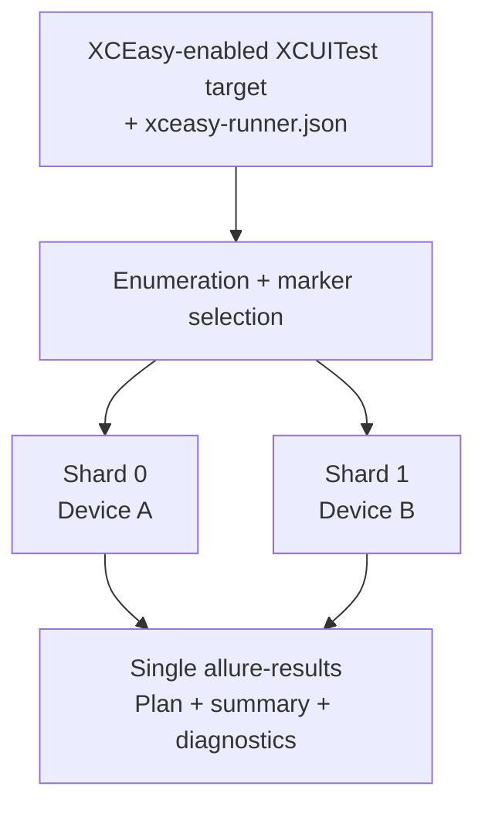

# XCEasy Runner

XCEasy Runner is a CLI runner for UI tests built with [XCEasy](https://github.com/qa-point/xceasy). It runs XCUITest suites across iOS Simulators, physical iPhones/iPads, or a mixed matrix, selects tests through XCEasy metadata, distributes them across devices, and produces one validated `allure-results` directory.

[Русская версия](README_RU.md)

## Why it exists

XCEasy owns each UI test's steps, logs, metadata, and artifacts. XCEasy Runner coordinates the complete suite execution:



### Execution modes

The `mode` field is required. It determines whether devices accelerate one suite execution or each
device validates the complete suite.

| Mode | Distribution | Executions per test | Use it for |
|---|---|---:|---|
| `shard` | The runner splits the suite into shards and executes them concurrently across available devices. | Once, on exactly one device. | The main CI run when speed matters and devices are equivalent. |
| `replicate` | The runner executes the complete selected suite concurrently on every device. | Once on every device. | A device/OS compatibility matrix where every environment must run every test. |

For example, 100 tests across 4 devices in `shard` mode produce approximately 25 tests per device
and 100 total executions. In `replicate` mode, every device runs all 100 tests, producing 400 total
executions.

## Requirements

- macOS with full Xcode;
- an XCUITest target with XCEasy integrated and configured; standalone XCTest without XCEasy is not supported;
- iOS Simulator and/or connected, trusted physical iOS devices enabled for development;
- Swift XCTest methods; Objective-C bundle enumeration is not supported in 0.1.0;
- `bash`, `jq`, `xcodebuild`, `xcrun`, `plutil`, and `shasum`;
- a UI-test target that persists XCEasy `allure-results` in its runner container.

The CLI honors an explicit `DEVELOPER_DIR`, then checks `xcode-select`, `/Applications/Xcode.app`, and `/Applications/Xcode-beta.app`. It does not require changing the system-wide selection.

## Quick start

See [Installation and first run](docs/en/GETTING_STARTED_EN.md) for the complete GitHub Release,
Homebrew, Nix, and initial configuration walkthrough.

Install the public release with Homebrew:

```bash
brew tap qa-point/runner https://github.com/qa-point/xceasy-runner.git
brew install qa-point/runner/xceasyctl
xceasyctl version
```

Or install the immutable release tag with Nix:

```bash
nix profile add github:qa-point/xceasy-runner/v0.1.3
xceasyctl version
```

Run through Nix without installing:

```bash
nix run github:qa-point/xceasy-runner/v0.1.3 -- version
```

Version 0.1.2 supports Nix on Apple Silicon and Intel macOS, with native builds checked in CI. The Homebrew formula follows the latest published release.

### Build and install the CLI

The public `xceasyctl` command is a compiled Swift executable. Shell orchestration is installed privately under `libexec` and is not the user entrypoint:

```bash
make build
sudo make install
xceasyctl version
```

Install without `sudo` under another prefix:

```bash
make install PREFIX="$HOME/.local"
export PATH="$HOME/.local/bin:$PATH"
```

`make package` creates a release archive and SHA-256 checksum under `dist/`. The archive contains the binary under `bin/` and its private engine under `libexec/xceasy-runner/`. This is an installable binary CLI, but not yet a single-file executable: coordinator modules are being migrated from shell to Swift incrementally.

Copy [the example configuration](examples/xceasy-runner.json) to the test-project root as `xceasy-runner.json`, set workspace/scheme/target/runner bundle ID/devices, and install the compiled CLI. Then run:

```bash
xceasyctl test --plan-only
xceasyctl test
```

Each launch creates an isolated `run-*` directory. Use `allure-results/` for Allure and inspect `execution-plan.json`, `execution-summary.json`, `diagnostic-summary.json`, and `artifact-manifest.json` for machine-readable decisions and evidence.

## Marker selection

```bash
xceasyctl test --annotation Team1
xceasyctl test --annotation Team1 --annotation Team2
xceasyctl test --require-annotation Smoke --require-annotation IOS
xceasyctl test --exclude-annotation Debug
```

Repeated `--annotation` is OR, `--require-annotation` is AND, and exclusions take precedence. CLI selection replaces `selection` for that run without changing the source JSON.

## Configuration

The current and first public contract is [execution-config-1.0.0.schema.json](schemas/execution-config-1.0.0.schema.json). Validate it without running tests:

```bash
xceasyctl validate-config xceasy-runner.json
```

| Field | Behavior |
|---|---|
| `mode` | `shard` distributes the suite; `replicate` runs it on every device. |
| `workspace`, `scheme`, `test_target` | Xcode inputs; relative paths resolve from the config file. |
| `runner_bundle_id` | `.xctrunner` bundle whose container stores results. |
| `devices` | `{type, id}` or `{type, name}` selectors for simulator/physical devices. |
| `physical_device` | Optional development team and Xcode provisioning/registration permissions. |
| `state_isolation` | `none` or `app_reset_hook`, requesting a consumer-defined reset before every test launch. |
| `test_plan` | Name of an `.xctestplan` associated with the scheme; paired with `test_configuration`. |
| `test_configuration` | Exactly one configuration from that plan, for example `English`. |
| `require_all_devices` | Fail on any rejected device when true; otherwise continue with healthy devices. |
| `retry_missing_tests` | Retry missing executions only, never completed assertion failures. |
| `max_recovery_attempts` | Recovery rounds from `0` through `5`; default `2`. |
| `selection.include_any` | Keep tests matching at least one marker. |
| `selection.include_all` | Require every marker. |
| `selection.exclude` | Exclude regardless of include rules. |
| `output_directory` | Root for isolated run directories. |
| `performance_environment_key` | Comparable environment key for timing trends. |
| `performance_baseline` | Optional previous baseline JSON. |
| `performance_policy` | Optional comparison policy; built-in policy is the default. |

Temporary execution overrides are available:

```bash
xceasyctl test --mode shard --simulator UDID_A --physical-device UDID_B --no-recovery
```

`--device` remains a legacy alias for `--simulator`. Mixed runs build separate `iphonesimulator` and `iphoneos` products; recovery never moves a missing test across device types.

Select a test plan in config or for one invocation:

```bash
xceasyctl test --test-plan UIKitExampleTestPlan --test-configuration English
```

The runner deliberately requires one configuration because multiple configurations repeat every XCTest and make shard/recovery identity ambiguous. Use a CI matrix with one runner invocation per configuration for multiple locales or environments.

`app_reset_hook` is not an iOS equivalent of Android `pm clear`: iOS exposes no fast system API for clearing an app sandbox and privacy grants without removing the app. The runner passes `XC_EASY_STATE_ISOLATION=app_reset_hook` to the UI-test process, while the consumer clears its UserDefaults, Keychain, database, and files on launch. The runner deliberately does not reinstall the app.

## Isolation and recovery

Each worker owns a separate `.xctestrun`, `.xcresult`, log, and result directory. Losing one worker does not repeat already completed tests. Only missing executions may be reassigned in `shard` mode; an assertion failure remains a completed result.

## Documentation

- [Technical guide](docs/en/TECHNICAL_GUIDE_EN.md)
- [Installation and first run](docs/en/GETTING_STARTED_EN.md)
- [Specification](docs/en/spec/README_EN.md)
- [Project constitution](docs/en/PROJECT_CONSTITUTION_EN.md)
- [Code style](docs/en/CODE_STYLE_EN.md)
- [Contribution guide](docs/en/CONTRIBUTING_EN.md)
- [GitHub Releases](docs/en/RELEASING_EN.md)
- [ADRs](docs/en/adr/)

## Repository verification

```bash
./scripts/check.sh
```

Contract tests use fake Xcode/simctl and do not boot real simulators. A local real-device acceptance run should normally use two simulators.

## License

Apache License 2.0. See [LICENSE](LICENSE).
