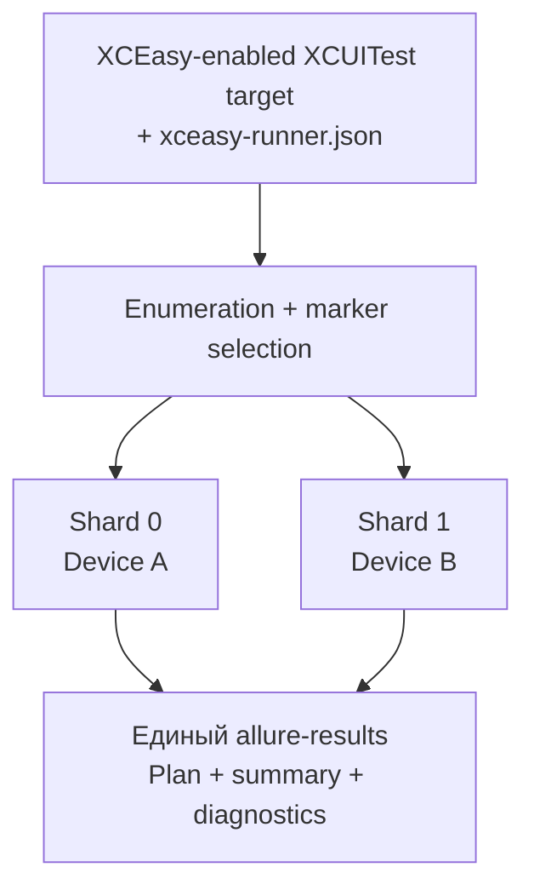

# XCEasy Runner

XCEasy Runner — CLI-раннер для UI-тестов, написанных на основе [XCEasy](https://github.com/qa-point/xceasy). Он запускает XCUITest-наборы на iOS Simulator, физических iPhone/iPad и смешанной matrix, отбирает тесты по XCEasy metadata, распределяет их между устройствами и собирает единый проверенный каталог `allure-results`.

English: [README.md](README.md)

## Зачем он нужен

XCEasy отвечает за отдельный UI-тест, его шаги, логи, metadata и артефакты. XCEasy Runner управляет запуском всего набора таких тестов:



### Режимы выполнения

Поле `mode` обязательно: оно определяет, нужно ли ускорить один прогон распределением тестов или
проверить весь набор на каждом устройстве.

| Режим | Распределение | Сколько раз выполняется тест | Когда использовать |
|---|---|---:|---|
| `shard` | Runner делит набор на шарды и параллельно запускает их на доступных устройствах. | Один раз — ровно на одном устройстве. | Основной CI-прогон, когда важна скорость и устройства эквивалентны. |
| `replicate` | Runner параллельно запускает полный выбранный набор на каждом устройстве. | По одному разу на каждом устройстве. | Device/OS compatibility matrix, когда один тест нужно проверить во всех окружениях. |

Например, 100 тестов и 4 устройства в `shard` дадут примерно по 25 тестов на устройство и 100
выполнений суммарно. В `replicate` каждое устройство выполнит все 100 тестов — суммарно 400
выполнений.

## Требования

- macOS и полный Xcode;
- XCUITest target с подключённым и настроенным XCEasy; автономный XCTest без XCEasy не поддерживается;
- iOS Simulator и/или подключённые, доверенные физические iOS devices, подготовленные для разработки;
- test methods на Swift; enumeration Objective-C bundles не поддерживается в 0.1.0;
- `bash`, `jq`, `xcodebuild`, `xcrun`, `plutil`, `shasum`;
- UI-test target, который сохраняет XCEasy `allure-results` в container test runner.

CLI уважает заданный `DEVELOPER_DIR`, затем проверяет `xcode-select`, `/Applications/Xcode.app` и `/Applications/Xcode-beta.app`. Системный `xcode-select` менять не требуется.

## Быстрый старт

Полная пошаговая инструкция по GitHub Release, Homebrew, Nix и первому config находится в
[«Установка и первый запуск»](docs/ru/GETTING_STARTED_RU.md).

### Сборка и установка CLI

Публичный `xceasyctl` собирается как Swift executable. Shell orchestration устанавливается приватно в `libexec` и не является пользовательским entrypoint:

```bash
make build
sudo make install
xceasyctl version
```

Для установки без `sudo`:

```bash
make install PREFIX="$HOME/.local"
export PATH="$HOME/.local/bin:$PATH"
```

Release-архив и SHA-256 checksum создаются командой `make package` в `dist/`. Архив содержит binary в `bin/` и private engine в `libexec/xceasy-runner/`. Это устанавливаемый бинарный CLI, но пока не single-file executable: coordinator мигрирует с shell engine на Swift поэтапно.

1. Скопируйте [пример конфигурации](examples/xceasy-runner.json) в корень тестового проекта как `xceasy-runner.json`.
   Установите compiled CLI через `make install` либо используйте binary из `.build/release/xceasyctl`.
2. Укажите workspace, scheme, test target, bundle ID runner и не более нужного числа simulator UDID.
3. Постройте план без запуска приложения:

```bash
xceasyctl test --plan-only
```

4. Запустите тесты:

```bash
xceasyctl test
```

Команда создаёт отдельный `run-*` каталог. Главный результат для Allure находится в `allure-results/`; причины решений и ошибок — в `execution-plan.json`, `execution-summary.json`, `diagnostic-summary.json` и `artifact-manifest.json`.

## Выбор по аннотациям

Маркер остаётся обычной метой, пока runner явно не использует его для отбора:

```bash
xceasyctl test --annotation Team1
xceasyctl test --annotation Team1 --annotation Team2
xceasyctl test --require-annotation Smoke --require-annotation IOS
xceasyctl test --exclude-annotation Debug
```

Повторный `--annotation` работает как OR, `--require-annotation` — как AND, исключение имеет приоритет. CLI-флаги выбора заменяют секцию `selection` текущего запуска и не изменяют исходный JSON.

## Конфигурация

Актуальная и первая публичная схема: [execution-config-1.0.0.schema.json](schemas/execution-config-1.0.0.schema.json). Проверка без запуска:

```bash
xceasyctl validate-config xceasy-runner.json
```

| Поле | Назначение |
|---|---|
| `mode` | `shard` делит набор; `replicate` повторяет весь набор на каждом device. |
| `workspace`, `scheme`, `test_target` | Xcode workspace, scheme и UI-test target. Относительные пути считаются от config. |
| `runner_bundle_id` | Bundle ID `.xctrunner`, из container которого экспортируются результаты. |
| `devices` | `{type, id}` или `{type, name}` для simulator/physical. Недоступные и неоднозначные устройства фиксируются preflight. |
| `physical_device` | Опциональные development team и разрешения Xcode обновлять provisioning/registration. |
| `state_isolation` | `none` либо `app_reset_hook`: запрос consumer-defined reset перед каждым test launch. |
| `test_plan` | Имя `.xctestplan`, подключённого к scheme. Используется вместе с `test_configuration`. |
| `test_configuration` | Ровно одна configuration из test plan, например `English`. |
| `require_all_devices` | `true` останавливает запуск при любом rejected device; `false` продолжает на healthy devices. |
| `retry_missing_tests` | Повторяет только не завершившиеся executions, а не упавшие product assertions. |
| `max_recovery_attempts` | Число recovery rounds от `0` до `5`; default `2`. |
| `selection.include_any` | Оставить тесты хотя бы с одним marker. |
| `selection.include_all` | Требовать все перечисленные markers. |
| `selection.exclude` | Исключить marker независимо от include. |
| `output_directory` | Корень всех изолированных run directories. |
| `performance_environment_key` | Ключ совместимого окружения для сравнения timings. |
| `performance_baseline` | Опциональный предыдущий baseline JSON. |
| `performance_policy` | Опциональная policy сравнения; иначе используется встроенная. |

CLI может временно заменить mode, devices, output и recovery:

```bash
xceasyctl test --mode shard --simulator UDID_A --physical-device UDID_B --no-recovery
```

`--device` сохранён как legacy alias для `--simulator`. Mixed run отдельно собирает `iphonesimulator` и `iphoneos`; recovery не переносит missing test между разными типами устройств.

Test plan можно выбрать в config или только для текущего запуска:

```bash
xceasyctl test --test-plan UIKitExampleTestPlan --test-configuration English
```

Runner намеренно требует одну configuration: несколько configurations повторяют каждый XCTest и размывают семантику shard/recovery. Для нескольких локалей или окружений используйте CI matrix с отдельным runner launch на каждую configuration.

`app_reset_hook` не является системным `pm clear`: iOS не даёт быстрого API для полной очистки sandbox и privacy grants без удаления приложения. Runner передаёт `XC_EASY_STATE_ISOLATION=app_reset_hook` в UI-test process, а consumer очищает свои UserDefaults, Keychain, БД и файлы при launch. Переустановка намеренно не выполняется.

## Независимость и восстановление

Каждый worker получает отдельный `.xctestrun`, `.xcresult`, log и каталог результатов. Уже завершившийся тест не повторяется после потери другого worker. Runner может переназначить только missing execution в `shard` mode; assertion failure считается выполненным результатом и не маскируется retry.

## Документация

- [Техническое устройство](docs/ru/TECHNICAL_GUIDE_RU.md)
- [Установка и первый запуск](docs/ru/GETTING_STARTED_RU.md)
- [Полная спецификация](docs/ru/spec/README_RU.md)
- [Конституция](docs/ru/PROJECT_CONSTITUTION_RU.md)
- [Code style](docs/ru/CODE_STYLE_RU.md)
- [Contribution guide](docs/ru/CONTRIBUTING_RU.md)
- [GitHub Releases](docs/ru/RELEASING_RU.md)
- [ADR](docs/ru/adr/)

## Проверка репозитория

```bash
./scripts/check.sh
```

Контрактные тесты используют fake Xcode/simctl и не запускают реальные симуляторы. Реальную acceptance-проверку выполняйте максимум на нужном числе устройств; для локальной машины достаточно двух.

## Лицензия

Apache License 2.0. См. [LICENSE](LICENSE).
